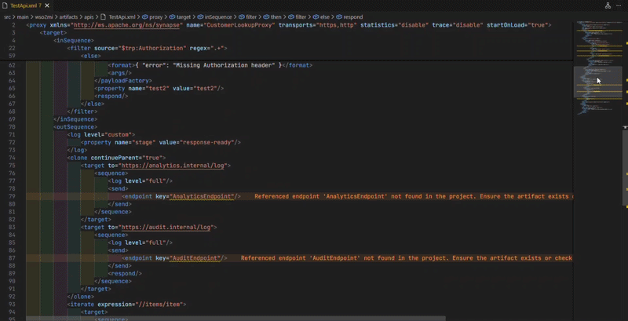
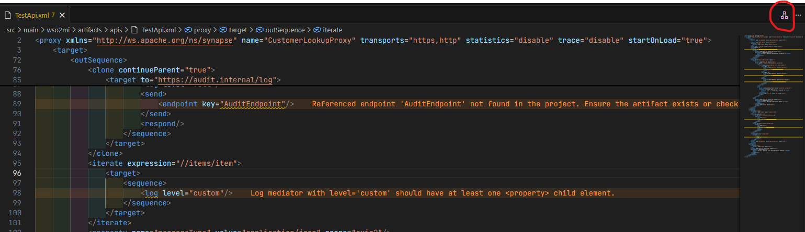
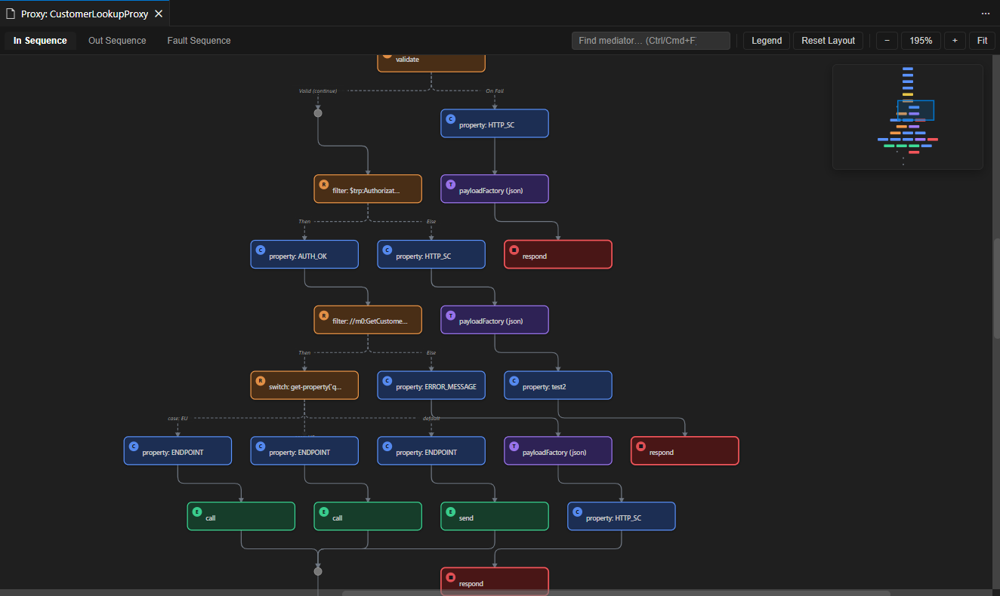

# Flow Visualizer for WSO2

**Flow Visualizer for WSO2** is a Visual Studio Code extension that transforms WSO2 Synapse mediation flows into an interactive, navigable diagram directly inside Visual Studio Code.

Whether you're working with Proxy Services, APIs, or Sequences, the extension helps you understand complex mediation logic through an interactive flow diagram that stays synchronized with the XML source.

> **Disclaimer**
>
> This extension is an independent community project and is **not** officially affiliated with, endorsed by, or sponsored by **WSO2 Inc.** WSO2® is a trademark of WSO2 Inc., and all product names are used solely to indicate compatibility.

---

# Features

## Interactive Flow Visualization

- Visualize WSO2 Synapse mediation flows as interactive diagrams.
- Automatic layered top-to-bottom layout for improved readability.
- Open diagrams beside the XML editor for a seamless development experience.
- Dedicated **Activity Bar** integration for quick access to the Flow Visualizer.

---

## Supported Artifacts

The extension supports visualizing the following WSO2 Synapse artifacts:

- Proxy Services
- APIs
- Standalone Sequences

For API artifacts, each resource is visualized independently with separate tabs for its mediation sequences.

Unsupported Synapse artifact types such as:

- Endpoints
- Local Entries
- Message Stores
- Message Processors
- Tasks
- Inbound Endpoints
- Data Services

are automatically detected and reported with clear, user-friendly messages instead of confusing parser errors.

---

## Comprehensive Mediator Support

Supports visualization of a broad range of WSO2 mediators, including:

- Routing
- Transformation
- Endpoint
- QoS
- Eventing
- Validation
- Iteration
- Aggregation
- Cloning
- Database
- Extension mediators

Advanced mediation constructs including:

- Filter
- Switch
- Validate
- Iterate
- ForEach
- Clone
- Aggregate

are rendered with accurate branching, merging, and execution flow semantics.

Unknown or custom mediators are still visualized as generic nodes rather than causing the visualization to fail.

---

## Interactive Navigation

The diagram remains synchronized with the XML editor.

Features include:

- Click any node to jump directly to its XML definition.
- Cursor synchronization between the editor and the diagram.
- Automatic highlighting of the currently selected mediator.
- Live synchronization while editing.
- Quick access through the Activity Bar.

---

## Large Flow Support

Designed for real-world enterprise integrations.

Navigation features include:

- Minimap
- Search (`Ctrl`+`F` / `Cmd`+`F`)
- Zoom controls (5%–800%)
- Fit to Screen
- Horizontal and vertical scrollbars
- Draggable nodes
- Reset Layout
- Sequence tabs
- Toggleable legend

These tools make navigating mediation flows containing hundreds of mediators simple and intuitive.

---

## Live Synchronization

Choose how the visualization updates:

- On Type
- On Save
- Disabled

The refresh debounce interval is configurable.

---

# Getting Started

There are multiple ways to open the Flow Visualizer.

## Option 1 – Activity Bar (Recommended)

1. Open a supported WSO2 Synapse XML file.
2. Click the **Flow Visualizer** icon in the Visual Studio Code Activity Bar.
3. Open the visualization from the sidebar.

## Option 2 – Command Palette

1. Open a supported WSO2 Synapse XML file.
2. Press **Ctrl+Shift+P**.
3. Run:

```text
Flow Visualizer: Show Diagram
```

## Option 3 – Editor Toolbar

When viewing a supported XML file, click the **Show Diagram** button in the editor toolbar.

The visualization opens beside the XML editor and remains synchronized with your source code.

---

# Extension Settings

| Setting | Default | Description |
|---------|---------|-------------|
| `flowVisualizer.liveSync` | `onType` | Controls when the diagram refreshes (`onType`, `onSave`, or `off`). |
| `flowVisualizer.debounceMs` | `400` | Debounce delay (milliseconds) before re-rendering when live synchronization is enabled. |

---

# Known Limitations

- Referenced external sequences (for example, `<sequence key="SharedSequence"/>`) are currently not expanded inline.
- The visualizer focuses on mediation flow. Synapse artifacts that do not contain executable mediation logic are intentionally not visualized.
- Very large mediation flows may require the minimap or search for the best navigation experience.

---

# Requirements

- Visual Studio Code **1.85.0** or later

---

# Roadmap

Planned improvements include:

- Cross-file sequence resolution
- Export diagrams as SVG and PNG
- Additional layout options
- Performance optimizations for extremely large mediation flows
- Support for saving custom node positions
- Enhanced Activity Bar experience with artifact explorer

---

# Contributing

Contributions, bug reports, feature requests, and suggestions are welcome.

If you discover an issue or have an idea for improvement, please open an issue or submit a pull request when the project becomes publicly available.

---

# Acknowledgements

Special thanks to the WSO2 community for building and maintaining the Synapse ecosystem that inspired this extension.

## Demo



# Screenshots

## Activity Bar Integration



Access the Flow Visualizer directly from the VS Code Activity Bar.

---

## Interactive Flow Diagram



Visualize Proxy Services, APIs, and Sequences as an interactive mediation flow.

---
